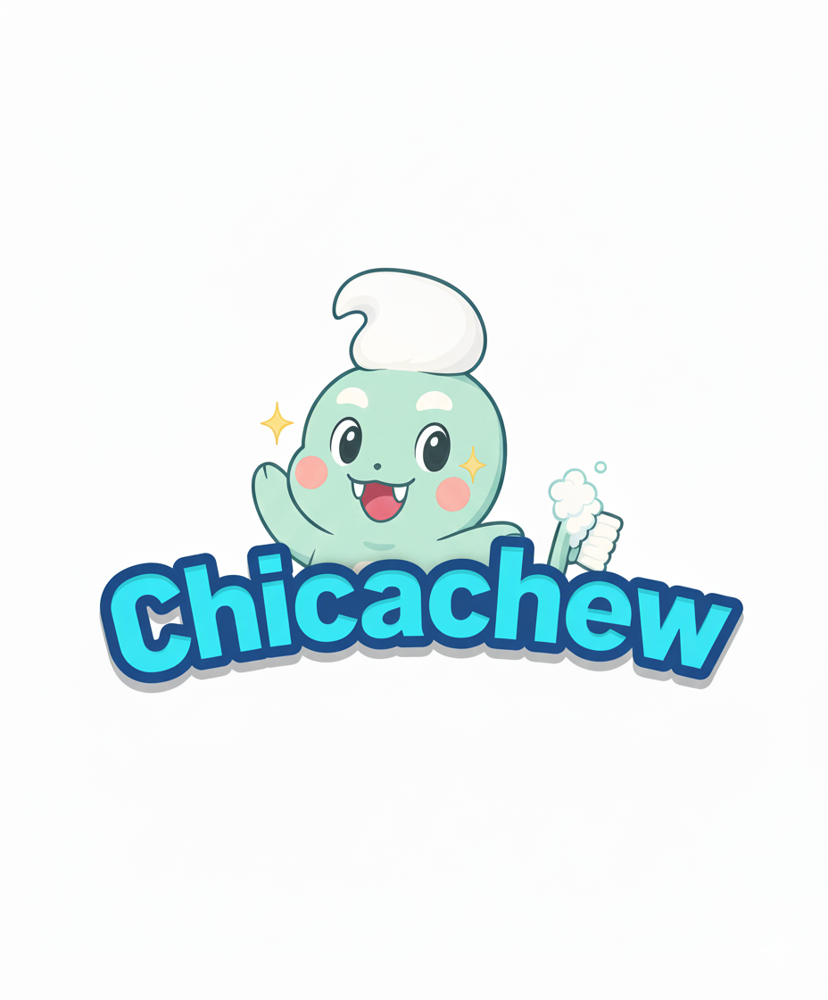

#  치카츄(ChicaChew): 딥러닝 기반 어린이 구강 건강 관리 솔루션 

  

**치카츄(ChicaChew)** 는 어린이의 올바른 양치 습관 형성 문제와 보호자·교사의 관리 부담을 해결하기 위해  
**MediaPipe 기반 랜드마크 추출, CNN·GRU 시계열 분류 모델, AR 실시간 피드백 및 게이미피케이션**을 결합하여  
양치 동작 인식, 실시간 교정 피드백, 개인 맞춤형 구강 관리 리포트를 제공하는 **AI 기반 디지털 헬스케어 솔루션**입니다.
***

## 기술 스택

| 구분       | 사용 기술 |
|-----------|-----------|
| 언어       |  |
| 데이터 처리 |     |
| 모델       |     |
| 시각화/서비스 |   |
***

## 시스템 아키텍처

***

## 주요 기능

### 1. 상품 정보 업로드
> 판매자가 상품 정보, 지역 정보, 생산자 스토리를 텍스트/음성으로 업로드  
> **Whisper API로 음성 → 텍스트 변환(STT)**

| 입력 화면 1 | 입력화면 2 | 입력화면 3 |  
|-------------|-------------|-------------|
|  |  |  |

### 2. 브랜드 스토리 생성
> **GPT-4o, LangChain, RAG**를 활용하여 브랜드 소개문, 슬로건, 핵심 키워드, 스토리를 자동 생성

| **브랜드 스토리 생성** |
|-------------|
|  |

### 3. 상품 홍보 이미지 생성
> **DALL·E 3 + Pillow, LangChain**을 통해 상품 우수성과 지역 특성을 반영한 이미지 생성

| **상품 홍보 이미지 생성** |
|-------------|
|  | 

### 4. 채널별 맞춤 마케팅 콘텐츠 제공
> 생성된 스토리·이미지를 기반으로 **Runway Gen-4 API**로 인스타그램, 유튜브, 블로그 등 채널에 최적화된 콘텐츠를 자동으로 생성

| 블로그 | 유튜브 | 인스타그램 |
|--------|--------|------------|
|  |  |  |
***

## 핵심 기여
  - **입력 파이프라인 구축**: 텍스트·음성(STT)·이미지 입력을 통합 처리할 수 있는 End-to-End 파이프라인 설계
  - **브랜딩 스토리 생성 모듈**: LangChain + RAG(Tavily API)를 활용해 지역성과 상품 맥락을 반영한 브랜드 스토리 자동 생성
  - **이미지 생성 및 후처리**: OpenAI DALL·E 3 + Pillow를 활용해 상품 홍보 이미지 생성 후, 색보정·텍스트 오버레이 처리
***

## 폴더 구조(요약)
<pre>
📂 로컬Grow/
 ┣ 📜 api_function.py           # OpenAI API, Runway 등 주요 API 호출 및 데이터 처리 함수 모듈
 ┣ 📜 app.py                    # Streamlit 실행 메인 파일 (웹 UI 구동)
 ┣ 📜 prompts.py                # LLM에 전달할 프롬프트 모음 (브랜딩 스토리, 콘텐츠 생성 등)
</pre>
***

