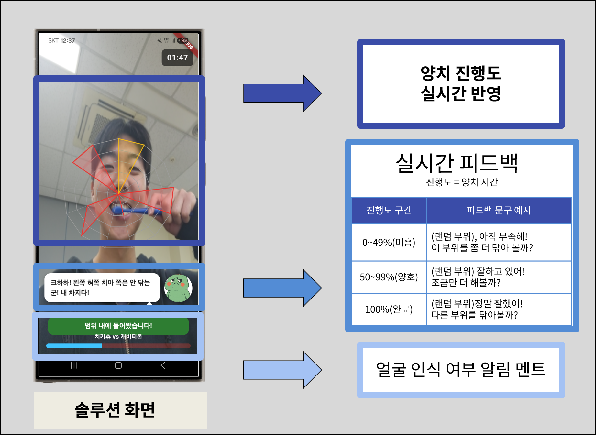
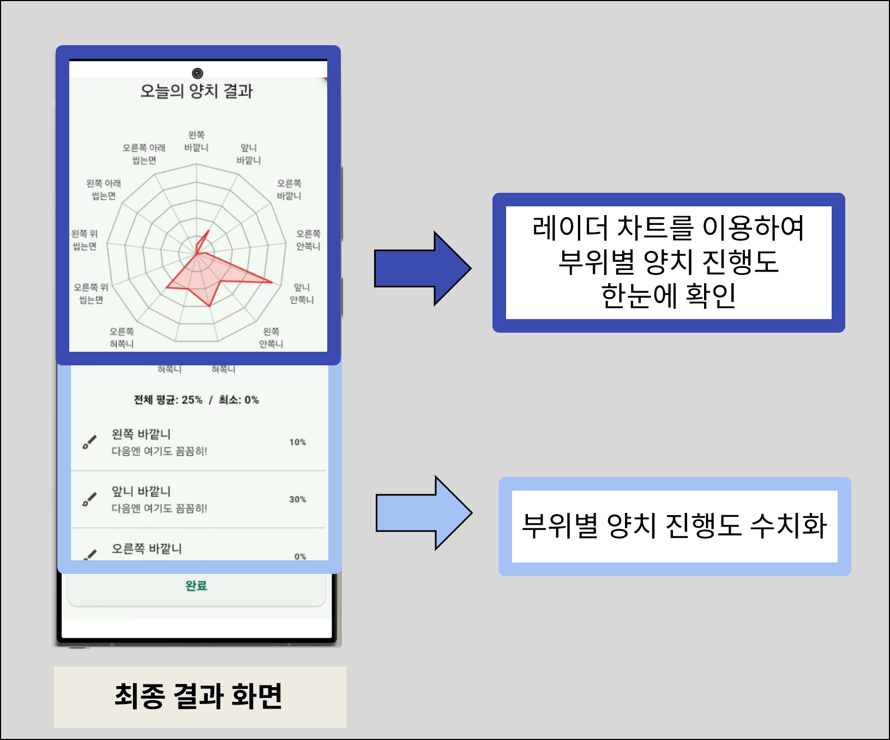
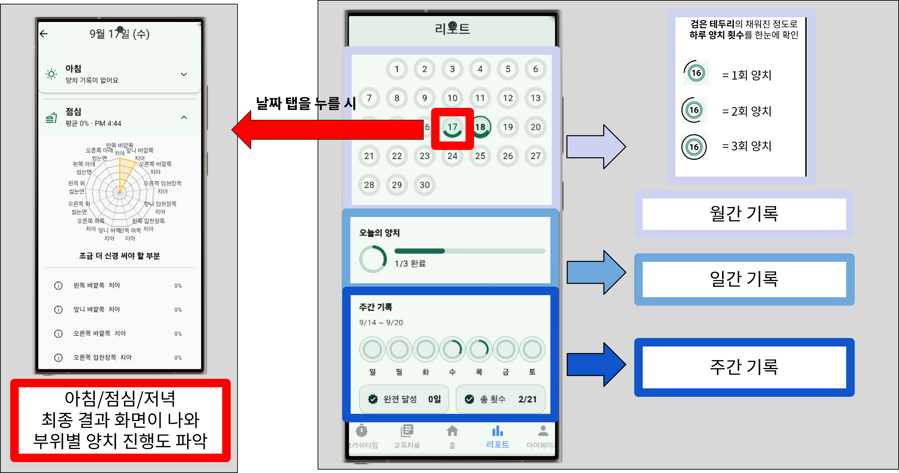

#  치카츄(ChicaChew): 딥러닝 기반 어린이 구강 건강 관리 솔루션 

  

**치카츄(ChicaChew)** 는 취약 가구 어린이의 올바른 양치 습관 형성 문제와 보호자·교사의 관리 부담을 해결하기 위해  
**MediaPipe 기반 랜드마크 추출, CNN·GRU 시계열 분류 모델, AR 실시간 피드백 및 게이미피케이션**을 결합하여  
양치 동작 인식, 실시간 교정 피드백, 개인 맞춤형 구강 관리 리포트를 제공하는 **AI 기반 디지털 헬스케어 솔루션**입니다.
***

## 기술 스택

| 구분       | 사용 기술 |
|-----------|-----------|
| 언어       |  |
| 프레임워크 |   |
| 데이터 처리 |      |
| 모델       |    |
| 최적화     |  |
| 시각화     |   |
***

## 시스템 아키텍처

***

## 주요 기능

### 1. 데이터 수집 & 전처리
> 13가지 양치 동작을 라벨링하여 영상 데이터 수집
> MediaPipe 기반 얼굴·손 랜드마크 추출 및 정규화

| 데이터 수집 Tool | 데이터 전처리 | 
|--------|--------|
|  | |

### 2. 동작 인식
> CNN-GRU 모델을 활용한 양치 13부위 실시간 분류 (LOSO 검증, F1 score ≈ 85%)

| **동작 인식** |
|-------------|
|  |

### 3. 실시간 AR 피드백
> 레이더 차트와 캐릭터를 통한 동기부여

| **AR 피드백** | **최종 피드백** | **날짜별 피드백** |
|-------------|-------------|-------------|
|  |   |    | 
***

## 핵심 기여
  - **데이터 수집 툴 개발**: 13가지 양치 동작 영상 라벨링 데이터셋 구축
  - **EDA 수행**: 데이터 시계열 특성, 랜드마크 좌표 패턴 분석
  - **데이터 전처리**: MediaPipe 기반 얼굴·손 랜드마크(21포인트) 추출 및 정규화
  - **모델 개발**: CNN-GRU 기반 시계열 분류 모델 설계 및 학습
  - **모델 성능 개선**: LOSO 교차검증 적용, Optuna 기반 하이퍼파라미터 최적화, 랜드마크·시계열 특성 최적값 탐색(ACC 92% 달성)
***

## 모델링 아키텍처

***

## 폴더 구조(주요)
<pre>
📂 ChicaChew/
┣ 📜 config.py # 하이퍼파라미터 및 경로 설정
┣ 📜 final_model.keras # 학습 완료된 CNN-GRU 모델 가중치
┣ 📜 hyperparam_tune.ipynb # Optuna 기반 하이퍼파라미터 튜닝 실험 노트북
┣ 📜 image.png # 프로젝트 관련 이미지 (아키텍처/시각화 등)
┣ 📜 m1_feature_extraction_answer.py # MediaPipe 기반 랜드마크 추출 및 특징 벡터화
┣ 📜 m2_train_answer.py # CNN-GRU 모델 학습 파이프라인
┣ 📜 m3_evaluate_answer.py # LOSO 교차검증 및 성능 평가
┣ 📜 main.py # 전체 파이프라인 실행 스크립트
┣ 📜 real_time_inference.py # 실시간 카메라 기반 양치 동작 인식
┣ 📜 run.py # 실행 진입점 (main 호출)
┗ 📜 utils.py # 공통 유틸 함수 모음 (데이터 처리, 시각화 등)
</pre>
***

